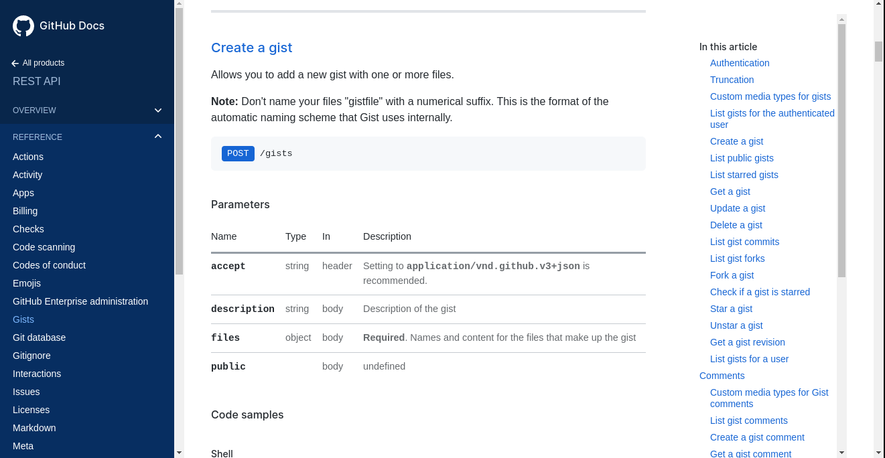
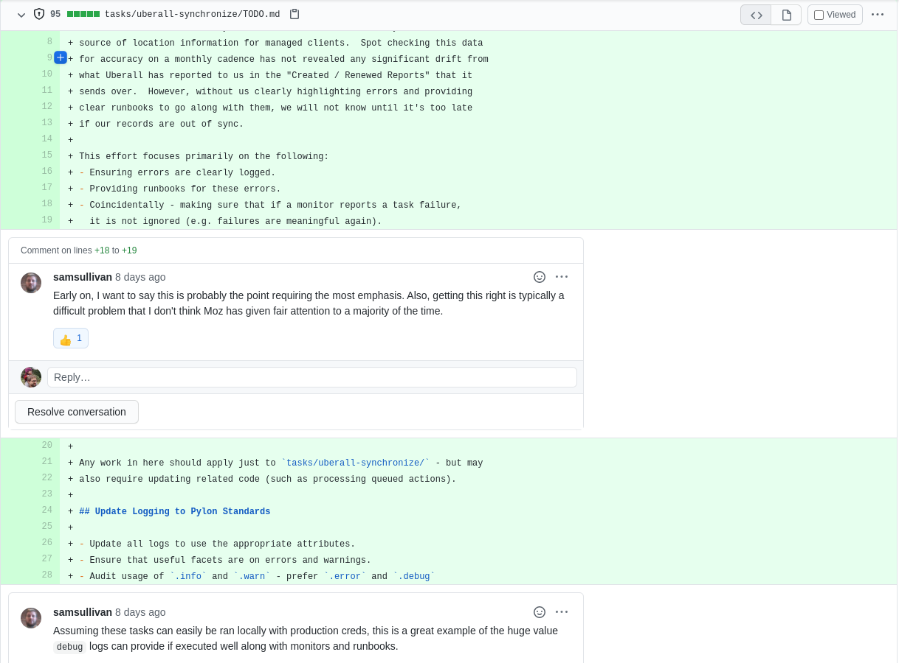
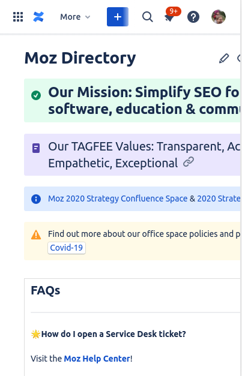

% I hate Confluence, but I love documentation.

------

# Confluence Sucks

## It's slow.

- So slow.
- Why does it take seconds to interact after the page loads?

## It's more than I need.

- Layouts / Tables / Designs
- Labels and Gizmos
- Embedded Google Docs
- ... then what's the point at all?
- Complicated Access Permissions
- Pretty-formatting links
- HOTKEYS?

------

------

## The bad features are like candy.

- When you see a feature, you use it.
- Sometimes less is more.

## Multi-User Editing - Gah!

- Editing a doc with multiple users is the worst.
- "Edit in Google Docs, copy to Confluence"

## Why am I so angry?!

The tool just keeps getting in my way.

# I ❤️ DOCS

## API Docs

Haven't we all picked platforms based on this?

## Solutions and Planning

- Reviewing a proposed feature.
- Iterating on a design.
- Faster than coding it.

------

------

## Standards Docs

- Force you to think through a problem.
- More valuable than tooling.
- And often lead to tooling!

## And so much more...

- Onboarding
- Processes
- Runbooks
- Progress
- Project Management
- Planning and Coordination

# ...

## Why is it to hard to do the right thing?

## Documentation fails when it's not kept up to date.

## Bad tools increase the friction to update documentation.

## Let's make documentation fun again?

# What I want.

## Simple diffs

## A simple API

## Markdown

- [https://commonmark.org/](https://commonmark.org/)
- It forces you to think linearly.
- Complicated data should use separate pages, not layouts.

## Mobile Friendly

------

Why the hell is this so hard?

😢😢😢😢😢😢😢

## Automatic Formatting

- Use Prettier or something.

## Diagrams as first-class citizens

- [https://plantuml.com/](https://plantuml.com/)
- [https://www.diagram.codes/](https://www.diagram.codes/)

## Collaborative Editing

Build something with this: [https://blog.cloudflare.com/introducing-workers-durable-objects/](Cloudflare Durable Objects)

## "Present" any doc without prep.

- Automatically generate slides.
- Tons of tools.
- [https://pandoc.org/](https://pandoc.org/)

## Commenting

## Commenting

### ✔️ Confluence

# What else?

## plz help.

I genuinely hate Confluence.

_I hate it so much._
